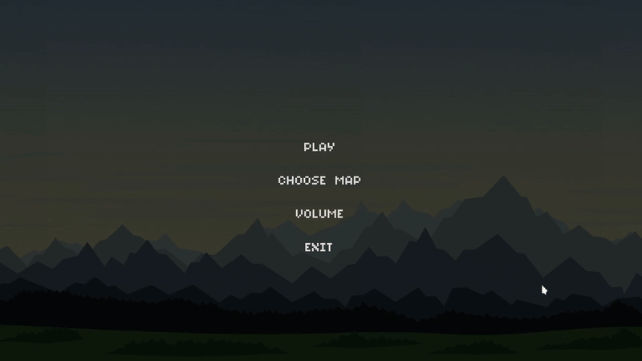

# Навыки и умения

Python, PyQt, Linux, Git

Опыт в ML почти нулевой, но хочу заниматься этим в будущем.
Интересует разработка desktop-приложений.

Сейчас изучаю C++

# Проекты

### Небольшая программа с использованием OpenCV([полное видео](opencv_demo.mp4))

### Приложение для наложения эффектов на изображения([полное видео](qt_app.mp4))

## Другие проекты

### 2D игра-платформер ([полное видео](game_demo.mp4))

### Ремейк игры Rapid Roll с Nokia

# Свобдное время

### Нечётные недели
|День| время                       |
|----|-----------------------------|
|Вт  | 15:30 -                     |
|Чт  | 09:00 - 11:00               |

### Чётные недели
|День| время                       |
|----|-----------------------------|
|Пн  | 15:30 -                     |
|Вт  | 09:00 - 11:00   15:30 - |
|Пт  | 09:00 - 11:00               |
